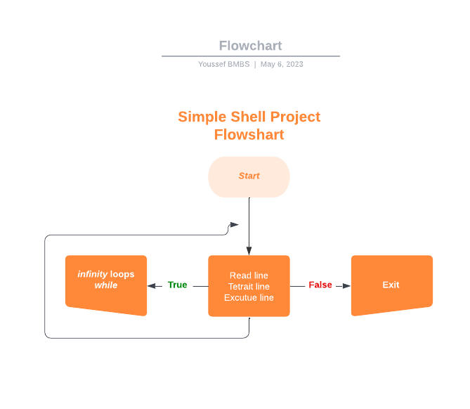

<h1 align="center">
	  Simple Shell Project
</h1>

<p align="center">
	<b><i>HOLBERTON SCHOOL Simple Shell</i></b><br>
</p>

<p align="center">

</p>

<h3 align="center">
	<a href="#Description">description</a>
	<span> · </span>
	<a href="#Algorithm-and-logic-behind-this">algorithm</a>
	<span> · </span>
	<a href="#Compilation-and-testing">Testing</a>
</h3>

---

## 📋 Simple Shell:

 <h3 simple_shell </h3> This is a brief description of a command interpreter program for the UNIX operating system. 

## 🔍 Description: 

 <h3 simple_shell </h3>  This is a description of a simple UNIX command language interpreter program. The program can read commands from a file or from standard input and execute them accordingly.


## 📇  simple shell steps:

The shell is an infinity loop that keep running until exit command or end of file.
<br>
			Pic5 
			<br>
Read the input
Parse or traite the commande
<br>
			Pic 6
			<br>
Execute the commande :
<br>
		. 	Search the commande in the environment
		<br>
		.	search in the path 
		<br>
		. 	create the child process for the commande execution
		<br>
		.	free the memory return the output and return at the beginning
		<br>

Shell is a block of codes that is reusable and performs certain operations. Like any other programming language, Shell-Scripting also supports functions. Functions are popular for the following reasons:

* Help to reuse a piece of code.
* Improve the readability of the program.
* Make the program modular.
* Make maintenance easier.

There are two ways of writing functions:

* Keep the function in the same script where it is used.
* Write a library of useful functions inside a file and import the file in the script where it is required.

## 🛠️  Algorithm and logic behind this
* Check this flowchart explaining the functions flow


for more information check the
* [man page](https://github.com/JosephBmbs/holbertonschool-simple_shell/blob/master/man_1_simple_shell)


## 🔭  Compilation and testing

#### We are compiling via:
```
gcc -Wall -Werror -Wextra -pedantic -std=gnu89 *.c -o hsh
```
#### We are Testing via:

* This in interactive mode:
```
$ ./hsh
($) /bin/ls
hsh main.c shell.c
($)
($) exit
$
```
* But also in non-interactive mode:
```
$ echo "/bin/ls" | ./hsh
hsh main.c shell.c test_ls_2
$
$ cat test_ls_2
/bin/ls
/bin/ls
$
$ cat test_ls_2 | ./hsh
hsh main.c shell.c test_ls_2
hsh main.c shell.c test_ls_2
$
```
### EXEMPLE


## 🃏  Functions used:

* access
* chdir
* close
* closedir
* execve
* exit
* _exit
* fflush
* fork
* free
* getcwd
* getline
* getpid
* isatty
* kill
* malloc
* open
* opendir
* perror
* read
* readdir
* signal
* stat
* lstat
* fstat
* strtok
* wait
* waitpid
* wait3
* wait4
* write


## 🎯  What our file stand for:

* [README.md](https://github.com/JosephBmbs/holbertonschool-simple_shell/blob/master/README.md) :The README file
* [AUTHOR](https://github.com/JosephBmbs/holbertonschool-simple_shell/blob/master/AUTHORS):  This file contains the author of the project
* [execute.c](https://github.com/JosephBmbs/holbertonschool-simple_shell/blob/master/execute.c) : This file contains the function execute
* [split.c](https://github.com/JosephBmbs/holbertonschool-simple_shell/blob/master/split.c) : this file containe the function split line parse it in array of string
* [readline.c](https://github.com/JosephBmbs/holbertonschool-simple_shell/blob/master/read_line.c) : This file contains te function readlien
* [myshell.h](https://github.com/JosephBmbs/holbertonschool-simple_shell/blob/master/myshell.h) : The Header file
* [signal.c](https://github.com/JosephBmbs/holbertonschool-simple_shell/blob/master/signal.c) :


## Author:
* [Youssef Saad](https://github.com/HanaOuerghemmi)
